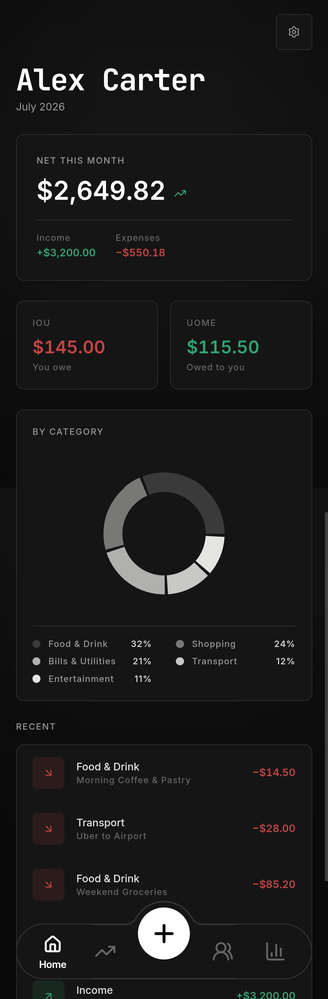
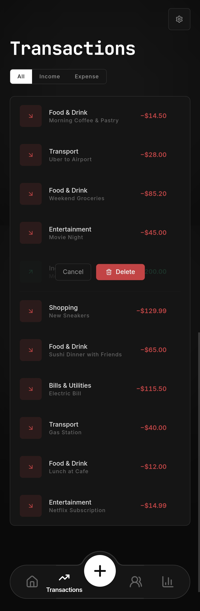
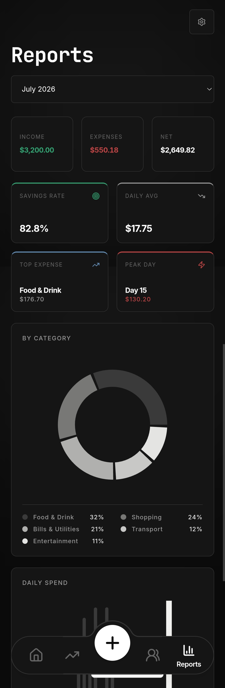

  

 

---

    
    &nbsp;&nbsp;
    

 

---

### App Preview

  
  &nbsp;&nbsp;
  
  &nbsp;&nbsp;
  

 

---

### Master your money. Seamlessly.

*Jarr is a premium, full-stack personal finance application designed to effortlessly track your expenses and manage shared bills. Built with a modern, fluid aesthetic, it empowers users to record daily transactions, seamlessly split bills with friends, manage debts, and gain visual insights into their spending habits.*

 

<table>
<tr>
<td width="25%" valign="top">

**Expense Tracking**
`Ultra-Fast`

Quickly record incomes and expenses with intuitive UI.

</td>
<td width="25%" valign="top">

**Visual Insights**
`Real-Time`

Detailed category breakdowns and spending trends.

</td>
<td width="25%" valign="top">

**Split Bills**
`Shared Expenses`

Seamlessly split expenses with friends directly in the app.

</td>
<td width="25%" valign="top">

**Debt Reminders**
`Automated`

Track who owes you and get daily push notifications.

</td>
</tr>
</table>

> **What makes Jarr different**
> - Premium, fluid user interface built with Tailwind CSS
> - Built-in shared billing functionality to manage group expenses
> - Push notifications to remind you of overdue debts
> - End-to-end security with JWT stateless authentication
> - Flawlessly responsive across mobile, tablet, and desktop

 

---

### What it does

<table width="100%">
  <tr>
    <td width="50%" valign="top" style="padding: 16px; border: 1px solid #d0d7de; border-radius: 10px;">
      <h3>Instant Tracking</h3>
      Record any expense or income in seconds. Assign custom categories, tags, and dates for perfect financial organization.
    </td>
    <td width="4%"></td>
    <td width="50%" valign="top" style="padding: 16px; border: 1px solid #d0d7de; border-radius: 10px;">
      <h3>Shared Bill Integration</h3>
      Paid for dinner? Instantly split the bill with your friends when recording the transaction, and Jarr will automatically track who owes what.
    </td>
  </tr>
  <tr><td colspan="3" height="10"></td></tr>
  <tr>
    <td width="50%" valign="top" style="padding: 16px; border: 1px solid #d0d7de; border-radius: 10px;">
      <h3>Debt Management</h3>
      Keep a clear ledger of all "I Owe You" and "Owed to Me" debts. Jarr manages your friendships and auto-completes names effortlessly.
    </td>
    <td width="4%"></td>
    <td width="50%" valign="top" style="padding: 16px; border: 1px solid #d0d7de; border-radius: 10px;">
      <h3>Smart Reminders</h3>
      Never forget a pending payment. The backend engine automatically sends Web Push Notifications to your devices when a debt is due.
    </td>
  </tr>
</table>

 

---

### Get started in 60 seconds

> **Try the live app:** You can instantly access the hosted version of Jarr at **[myjarr.vercel.app](https://myjarr.vercel.app)** without any setup!

Or, if you prefer to run it locally, follow these steps:

<table width="100%" cellspacing="0" cellpadding="0">
  <tr>
    <td width="36" valign="top" align="center">
      <strong>1</strong>
    </td>
    <td valign="top" style="padding-left: 12px;">
      <strong>Clone the Repository</strong>  
      Pull down the code directly from GitHub into your local environment: <code>git clone https://github.com/Prathmesh-D/Jarr.git</code>  
    </td>
  </tr>
  <tr><td colspan="2" height="20"></td></tr>
  <tr>
    <td width="36" valign="top" align="center">
      <strong>2</strong>
    </td>
    <td valign="top" style="padding-left: 12px;">
      <strong>Start the Backend</strong>  
      Navigate to the <code>backend/</code> directory. Ensure you have a local MySQL instance running, then launch the Spring Boot server using <code>./mvnw spring-boot:run</code>. Flyway will automatically migrate your database schemas on startup.  
    </td>
  </tr>
  <tr><td colspan="2" height="20"></td></tr>
  <tr>
    <td width="36" valign="top" align="center">
      <strong>3</strong>
    </td>
    <td valign="top" style="padding-left: 12px;">
      <strong>Start the Frontend</strong>  
      Navigate to the <code>frontend/</code> directory and install dependencies with <code>npm install</code>. Run the Vite development server using <code>npm run dev</code>. You are ready to start managing your money!  
    </td>
  </tr>
</table>

 

---

Built by **[Prathmesh Deshkar](https://github.com/Prathmesh-D)**

*If it was useful or interesting, a star is always appreciated.*

---

